# ルミ (Lumi) — 顔のあるコンソール風アシスタント

[English](#english)

コンソールそっくりのウィンドウの背景に顔が浮かび、返事を声で読み上げるアシスタントです。
まばたきやよそ見をし、喋るときは口が動きます。「ルミ」と呼びかければ声で話しかけられ、頼めば Web を調べたり PC を操作したりもします (PC の操作は実行前に確認します。確認なしで実行する自動モードもあります)。

<p align="center">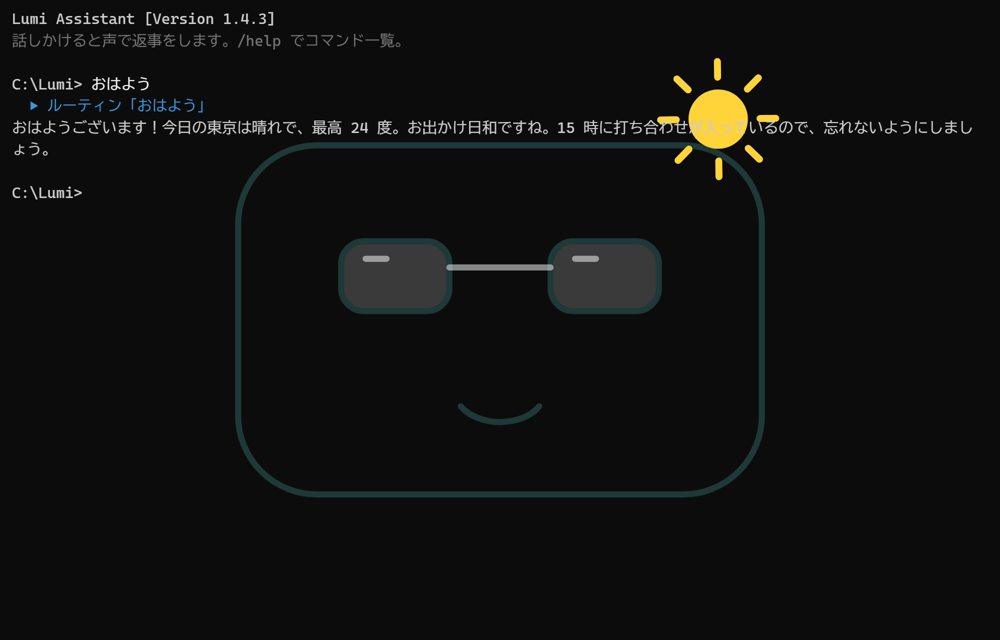</p>

- **Windows / macOS / Linux** に対応 (Go + [Wails](https://wails.io))
- **ローカルAIを標準搭載** — インターネットなしで会話できる ([llama.cpp](https://github.com/ggml-org/llama.cpp) + [Qwen3.5-4B](https://huggingface.co/Qwen/Qwen3.5-4B)、初回にダウンロード)
- **声で話しかけられる** — 呼びかけ・音声認識もPCの中だけで処理 ([Vosk](https://alphacephei.com/vosk/))
- **日本語・英語** に対応 (翻訳ファイルを足せば言語を増やせる)
- つなぐ AI は自由に選べる: ローカル / Claude / OpenAI 互換 API (Ollama・LM Studio など) / 自作スクリプト / AI なし

## スクリーンショット

<table>
<tr><td align="center" width="33%">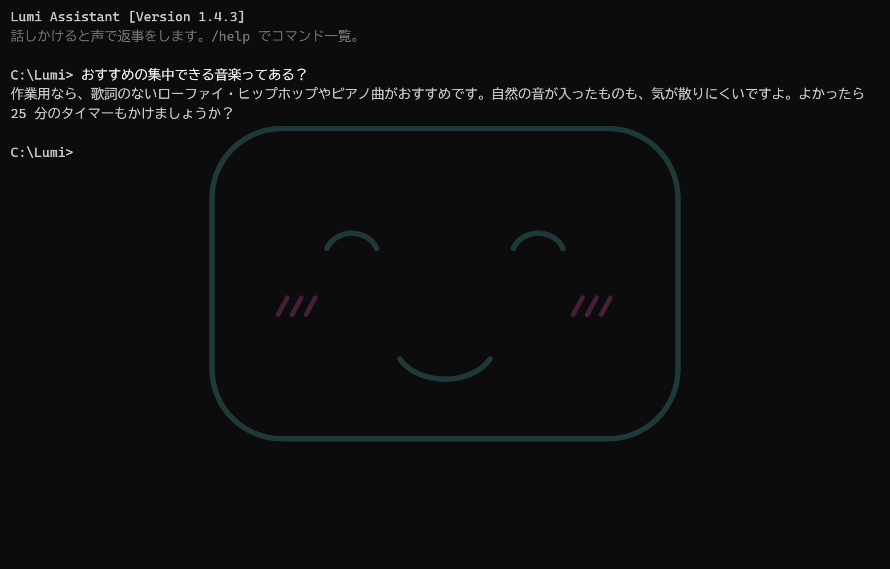<br><sub>話しかけると声で返事</sub></td><td align="center" width="33%">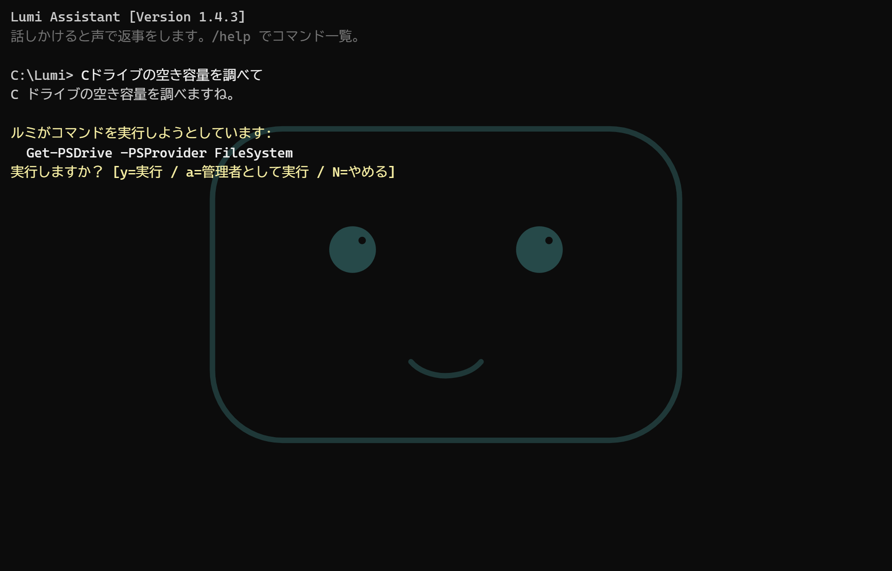<br><sub>PC の操作は実行前に確認</sub></td><td align="center" width="33%">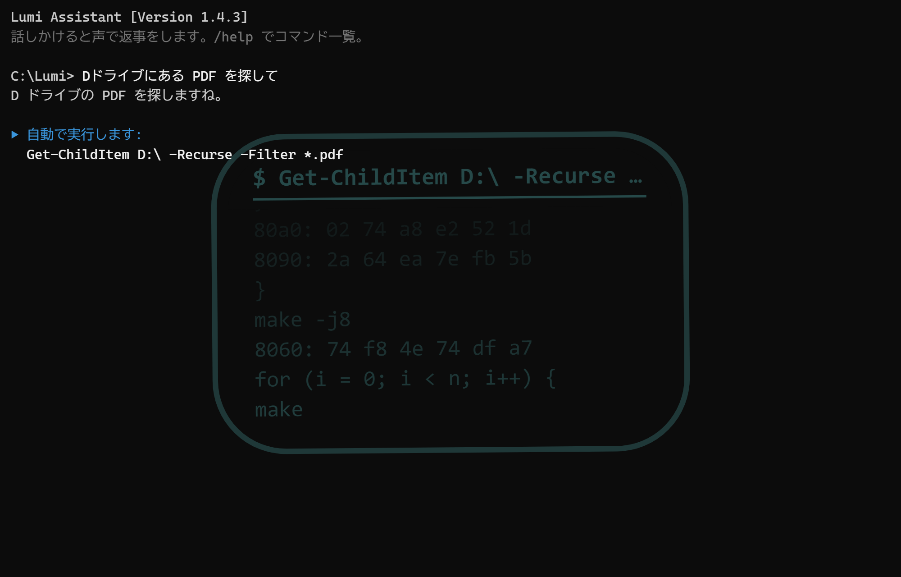<br><sub>コマンドの実行中は顔の中をプログラムが流れる</sub></td></tr>
<tr><td align="center" width="33%">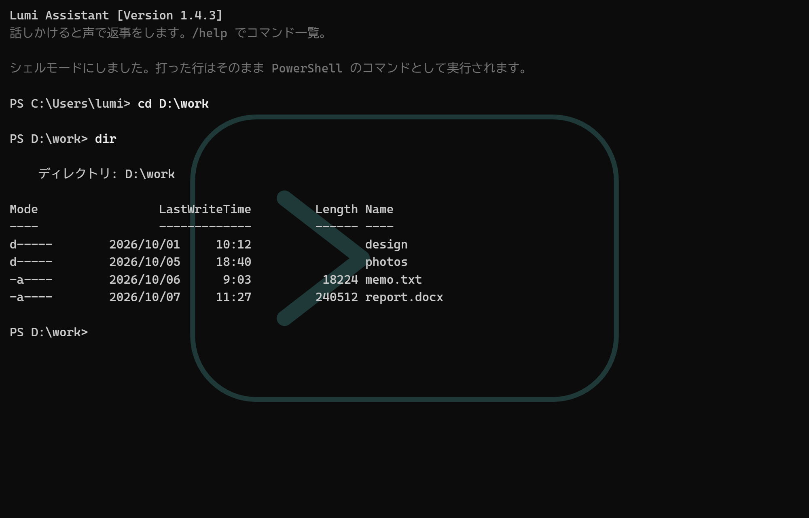_ に"><br><sub>シェルモードでは顔が >_ に</sub></td><td align="center" width="33%">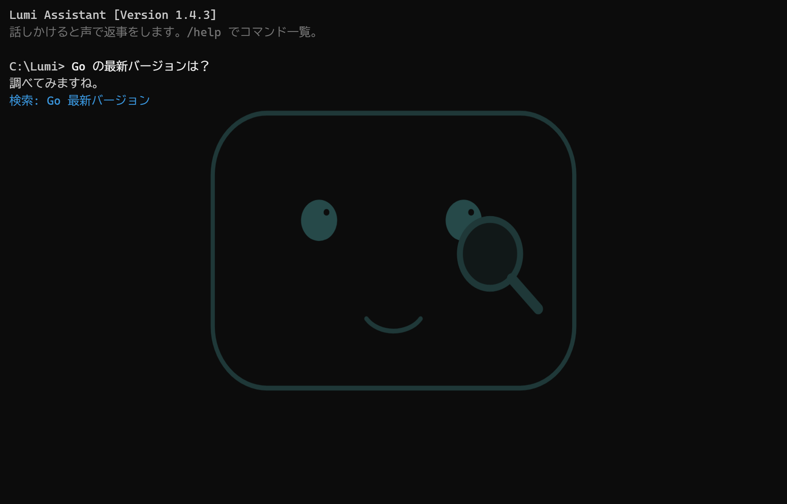<br><sub>Web を調べているところ</sub></td><td align="center" width="33%">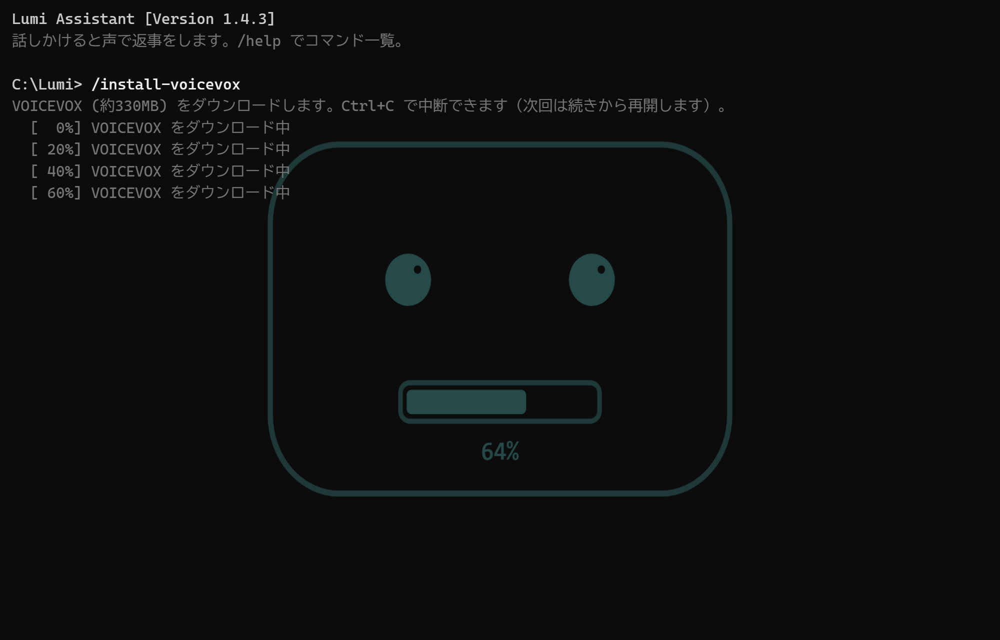<br><sub>ダウンロード中は口がプログレスバーに</sub></td></tr>
<tr><td align="center" width="33%">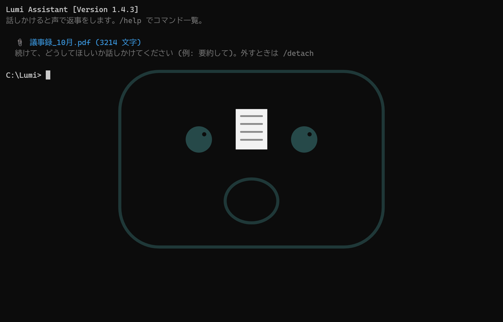<br><sub>落としたファイルを読み込む</sub></td><td align="center" width="33%"><br><sub>「おはよう」で天気と予定 (晴れ)</sub></td><td align="center" width="33%">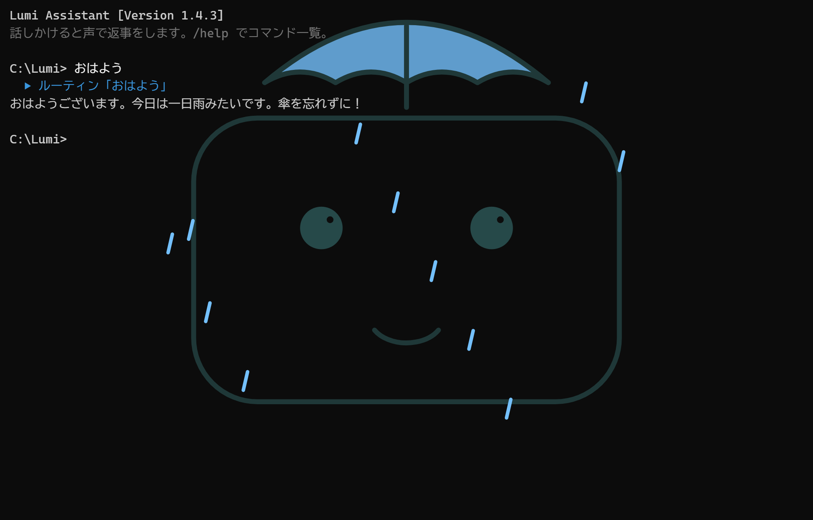<br><sub>雨の日は傘</sub></td></tr>
<tr><td align="center" width="33%">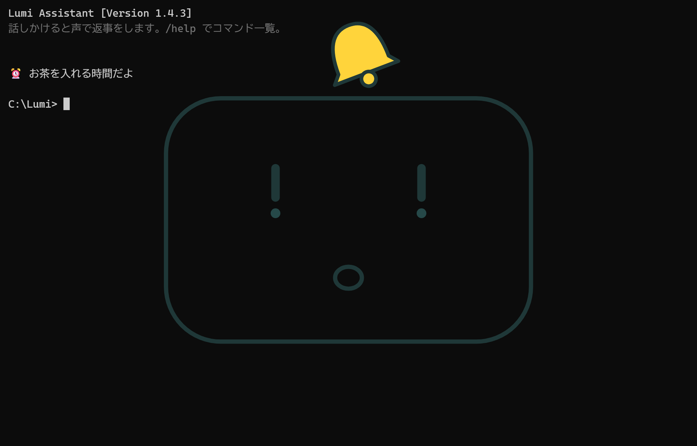<br><sub>リマインダー</sub></td><td align="center" width="33%">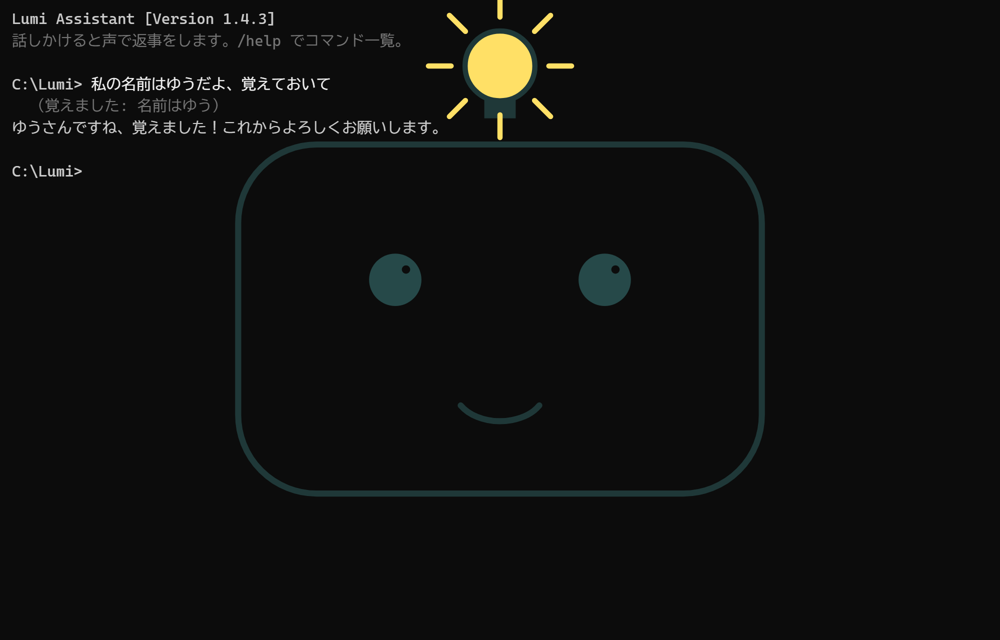<br><sub>名前や好みを覚える</sub></td><td align="center" width="33%">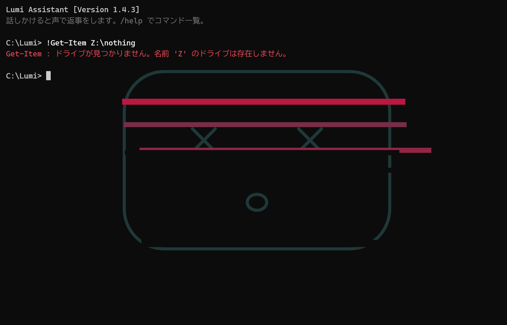<br><sub>エラーのときは顔が乱れる</sub></td></tr>
<tr><td align="center" width="33%">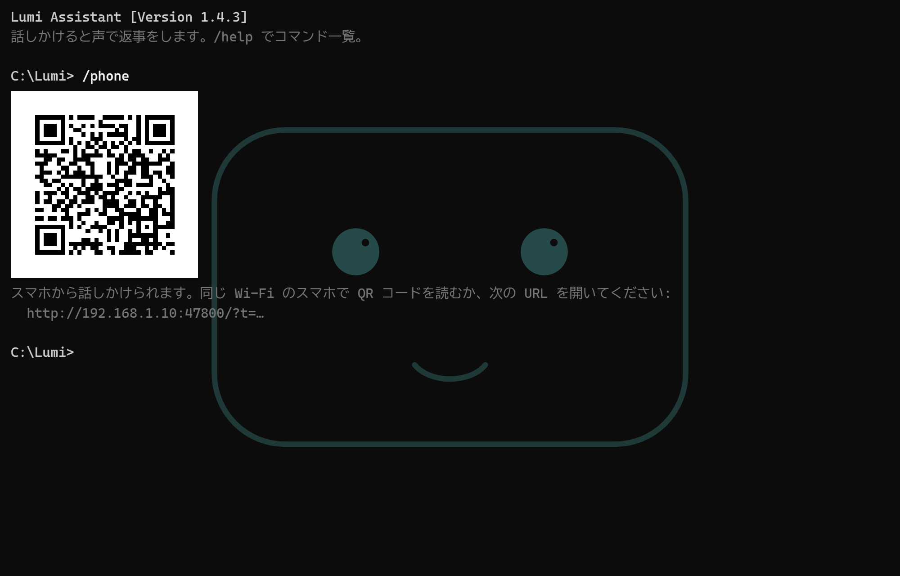<br><sub>/phone の QR コード</sub></td><td align="center" width="33%">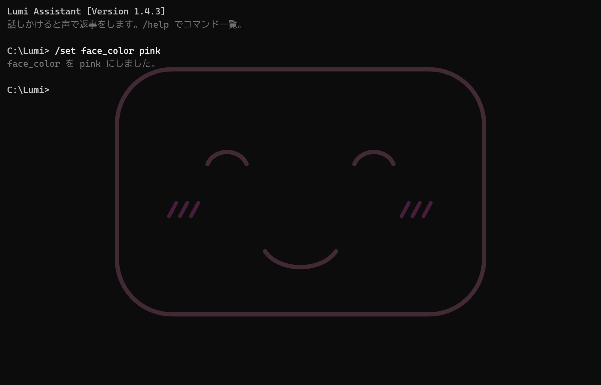<br><sub>顔の色を変えられる</sub></td><td align="center" width="33%">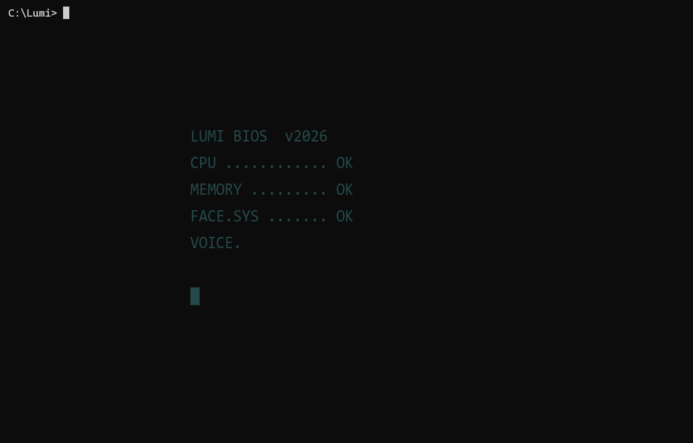<br><sub>起動画面</sub></td></tr>
</table>

<p align="center">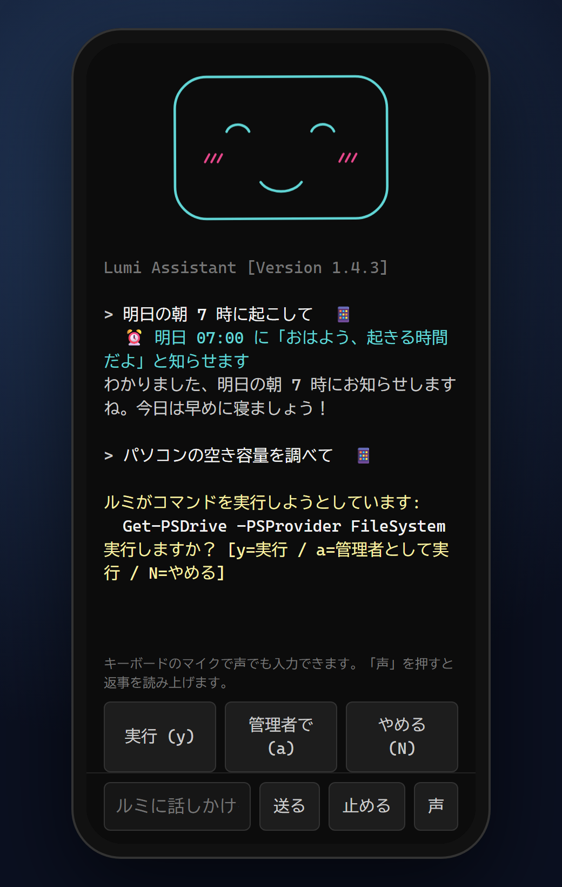<br><sub>同じ Wi-Fi のスマホから話しかける (/phone)</sub></p>

## インストール

[Releases](https://github.com/Hotakacchi/ai-console/releases/latest) からダウンロードします。

| OS | ファイル | |
|---|---|---|
| Windows 10 / 11 | `Lumi-Windows-Setup-<バージョン>.exe` | 「自分だけ (管理者権限なし)」か「すべてのユーザー」かを選べます。新しい版を実行すると上書き更新になります。 |
| macOS 11 以降 | `lumi-mac-<バージョン>.dmg` | Lumi.app を「アプリケーション」に入れます。署名していないので、初回は右クリック →「開く」で起動してください。 |
| Linux (x64 / arm64) | `lumi_*.deb` / `lumi-linux-*.tar.gz` | GTK4・WebKitGTK 6.0 が必要です (Ubuntu 24.04 以降など)。 |

インストーラーで「ローカルAIもダウンロードする」を選ぶと、初回起動時に、PC のメモリと GPU を調べて合ったローカルAI (0.8B〜9B、約0.6〜6GB) をダウンロードします。あとから `/install-local` でも入れられます (`/install-local list` で、おすすめと PC の性能が見られます)。
ローカルAI・VOICEVOX・Whisper は使うときに読み込み、1分使わなければ外してメモリを空けます (`/set idle_unload 分` で変更、`0` でずっと読み込んだまま)。

## 使い方

プロンプトに打ち込むか、「ルミ」と呼びかけて話しかけます。`/` で始まる入力はアプリのコマンドで、`Tab` で補完できます。

| コマンド | 内容 |
|---|---|
| `/help` | コマンド一覧 |
| `/settings` | 今の設定を一覧する |
| `/set <項目> <値>` | 設定を変えて、すぐ反映する (例: `/set language en`、`/set provider local`) |
| `/voices` | 読み上げに使える声の一覧 |
| `/config` | `settings.json` を開く |
| `/reload` | 設定ファイルを読み直す |
| `/mute` | 読み上げのオン/オフ |
| `/mic` | 音声入力のオン/オフ (初回は認識モデル約50MBをダウンロード) |
| `/install-local [list\|名前]` | ローカルAIをダウンロードする。`list` でモデルの一覧、名前でそのモデルを入れて切り替える。標準は Qwen3.5 (0.8B / 2B / 4B / 9B)。ほかに Phi-4 mini、Gemma 3 (1B / 4B / 12B)、gpt-oss 20B、Llama 3.2 3B / 3.1 8B、Mistral Small 3.2 24B、DeepSeek-R1 8B、Llama 3.1 Swallow 8B、Sarashina2.2 3B、LLM-jp-3.1 1.8B も選べる |
| `/install-voice` | 音声認識モデルをダウンロードする |
| `/install-voicevox` | より自然な声 (VOICEVOX、約330MB) を入れる |
| `/install-whisper` | より正確な音声認識 (Whisper) を入れる (Windows・Linux は whisper.cpp で約70MB、Mac は約110MB) |
| `/install-vision` | ローカルAIが画像を読めるようにする (約670MB) |
| `/attach [パス]` / `/detach` | ファイルを付ける / 外す (窓にドラッグ＆ドロップでも付けられる) |
| `/screen [質問]` | 画面を撮って見せる (例: `/screen このエラーは何？`) |
| `/words` | 音声の単語帳 (`words.txt`) を開く。名前や専門用語を書くと Whisper が聞き取りやすくなる |
| `/auto [on\|off]` | 自動モード (Shift+Tab でも切り替え)。AI が提案したコマンドを確認せずに実行する。管理者権限が必要なものと、削除・フォーマット・シャットダウンなどの危ない操作は確認する。Web・ファイル・クリップボード・画面など外から来た文章を読んだあとも、仕込まれた指示かもしれないので確認する (`/cls` まで) |
| タブの **+** / **×** | ターミナルのように、シェルのタブを開く / 閉じる (Ctrl+T / Ctrl+W、Ctrl+Tab で切り替え。**▾** でシェルを選んで開く)。最初の「ルミ」のタブは AI と話す |
| `/shell list` / `/shell <名前>` | 使えるシェルの一覧 / シェルの切り替え (pwsh・powershell・cmd・gitbash・wsl・bash・zsh・fish など。最初は自動で選ぶ) |
| `!コマンド` / `/shell` | コマンドをそのまま実行する / シェルモード (打った行がそのままコマンドになる。`exit` で戻る) |
| `/routines [名前]` | ルーティン (「おはよう」などでまとめて行うこと) の一覧と `routines.txt` を開く |
| `/discord [on\|off]` | Discord のステータスにルミの様子 (お話し中・コマンドを実行中など) を出す。会話の中身は出さない |
| `/phone [off]` | スマホから話しかける (同じ Wi-Fi のスマホで開く URL と QR コードを出す) |
| `/commands` | よく使うコマンドの単語帳 (`commands.txt`) を開く。「やりたいこと → コマンド」と書くと AI が優先して使う |
| `/memory` | 覚えていることの一覧 (`/memory delete <番号>`、`/memory clear`) |
| `/reminders` | タイマー・リマインダーの一覧 (`/reminders cancel <番号>`、`/reminders clear`) |
| `/history [件数]` | これまでの会話を表示する |
| `/update` | 新しい版に更新する (ダウンロードして入れ替え、起動し直す) |
| `/peek` | バックグラウンドで呼ばれたときの動きを試す |
| `/cls` | 画面と会話をリセット |
| `/exit` | 終了 |
| `Ctrl+C` / `Esc` | 返事を途中で止める |

### 声で話しかける

「ルミ」と呼ぶと聞く顔になるので、続けて話しかけます。「ルミ、今何時？」と一息で言っても大丈夫です。
ルミが返事をしたあとは、しばらく呼びかけなしで続けて話せます。ウィンドウを閉じてトレイにいるときに呼ぶと、画面の右下から顔が出てきます。
うまく反応しないときは `/set voice_debug on` で、何と聞こえたかを確かめられます。
アプリのコマンドも声で使えます。「ルミ、コマンド ミュート」「コマンド 自動モード オン」「コマンド 画面 このエラーは何」のように、「コマンド」(または「スラッシュ」) に続けて言います。アップデートや自動モード、ダウンロード、終了など、声で言うと困るものは実行前に確認します。

### Web 検索と PC の操作

- 最新の情報や知らないことは、ルミが自分で Web を調べて答えます (DuckDuckGo、API キー不要)。`/set web_search ask` で毎回確認、`off` で無効。
- 「メモリの使用量を調べて」のように頼むと、ルミが OS のコマンド (Windows は PowerShell、Mac は zsh、Linux は bash) を提案します。**実行前に必ずコマンドを表示して確認**し、`y` (声なら「実行して」) と答えたときだけ実行します。管理者権限が必要なときは、さらに OS の確認画面が出ます。`/set pc_control off` で無効。

AI の提案は間違っていることもあります。内容を確かめてから許可してください。
管理者権限で実行している間は、顔の色が琥珀色に変わります。

### そのほかの機能

- **表情** — 返事の内容に合わせて、うれしい顔・考える顔・驚いた顔などをします。
- **タイマー・リマインダー** — 「5分後に教えて」「15時に会議って言って」と頼むと、時間になったら声で知らせます (トレイにいるときは右下から顔を出します)。
- **覚える** — 「私の名前はほたかだよ、覚えておいて」と言うと覚えて、次からの会話に活かします。忘れてほしいときは「忘れて」と頼むか `/memory`。
- **会話の続き** — 前回の会話を覚えていて、起動したときに続きから話せます (`/set keep_history off` で無効、`/cls` で消去)。
- **クリップボード** — 「コピーした文を要約して」のように頼むと、クリップボードの文章を読みます (`/set clipboard ask` で毎回確認、`on` / `off`)。
- **ショートカット** — どこからでも `Ctrl+Alt+L` (Mac は `Cmd+Option+L`) でウィンドウを出し入れできます (`/set hotkey`)。
- **見た目** — 顔の色・大きさ、文字の大きさ・フォントを変えられます (`/set face_color pink` など)。
- **自然な声** — `/install-voicevox` で [VOICEVOX](https://voicevox.hiroshiba.jp/) の声で話し、声に合わせて口が動きます。`/voices` で声を選べます。
- **ファイルを読ませる** — 窓にファイルをドラッグ＆ドロップして「要約して」「この表の合計は？」のように頼めます。テキスト・PDF・Word・Excel・PowerPoint・画像に対応しています (ローカルAIで長いファイルを読むときは先頭の一部だけになります)。
- **画面を見せる** — 「この画面のエラーは何？」と聞くか `/screen` で、画面を撮って AI に見せます (撮る前に毎回確認します。`/set screen on` / `off`)。ローカルAIで画像を読むには `/install-vision` が必要です。
- **ルーティン** — 「おはよう」と言うと、今日の天気とリマインダーをまとめて話します。`/routines` で開く `routines.txt` に、「仕事モード」でアプリやフォルダをまとめて開く、などを自分で書けます。`[名前 @07:30]` のように時刻を付けると毎日自動で動きます。
- **スマホから** — `/phone` で出る QR コードを同じ Wi-Fi のスマホで読むと、スマホのブラウザから話しかけたり、返事を読み上げてもらったり、コマンドの確認に答えたりできます (家の中からだけ、鍵つきの URL でだけつながります。スマホから「実行」するときは、PC の画面に出る 4 桁の番号が必要です)。
- **自動アップデート** — 新しい版が出ると起動時に知らせ、`/update` でダウンロードから入れ替え・再起動まで行います。
- **正確な聞き取り** — `/install-whisper` で、話しかけた内容を [Whisper](https://github.com/openai/whisper) で書き起こします (呼びかけは Vosk のまま)。Windows・Linux では [whisper.cpp](https://github.com/ggml-org/whisper.cpp) で動かすので、話し終えてから 1 秒ほどで文字になります。`/set whisper_model small` でさらに正確に (少し遅くなります)。
- **ドライブ** — USB メモリなどをつなぐと、驚いた顔をして知らせます。
- **充電** — ノート PC を電源につなぐと、口が電池になって満ちていくアニメーションをします。
- **PC の見守り** — CPU やメモリが 1 分くらい 90% を超えたまま (メモリはいちばん使っているアプリの名前も)、ディスクの空きが 10GB を切った、バッテリーが 15% を切ったときに、困った顔で知らせます (`/set pc_watch off` で止める)。
- **自作コマンド (プラグイン)** — `/plugins open` で開くフォルダにスクリプトを置くと、ファイル名が `/名前` のコマンドになります (例: `backup.ps1` → `/backup`)。`.ps1`・`.bat`・`.cmd`・`.exe` (Windows)、`.sh` (Mac・Linux)、`.py`、`.js` が使えます。最初のコメント行が説明になり、AI も「バックアップして」のように頼むと使います (実行前に確認します)。
- **ターミナル版** — Windows ターミナルの新しいタブのメニューに「Lumi」が出て、タブの中でルミと話せます (Mac・Linux は `lumi --cli`)。会話・コマンドの実行・シェルモードは窓のルミと同じで、顔は `(・‿・)` のような顔文字になります。声と小窓は窓のルミだけです。

## 設定 (`settings.json`)

`/settings` で一覧、`/set` で変更できます。ファイルの場所は Windows が `%LOCALAPPDATA%\Lumi`、macOS が `~/Library/Application Support/Lumi`、Linux が `~/.local/share/lumi` です。

| 項目 | 内容 |
|---|---|
| `language` | `auto` (OS に合わせる) / `ja` / `en` |
| `provider` | `local` / `offline` / `anthropic` / `openai` / `command` |
| `model` / `endpoint` / `api_key_env` | モデル名・API の URL・API キーが入っている**環境変数の名前** |
| `pc_control` / `web_search` | PC の操作 / Web 検索 |
| `voice_input` / `wake_word` | 音声入力 / 呼びかけの言葉 (空なら言語ごとの既定) |
| `voice` / `voice_rate` | 読み上げの声 / 速さ |
| `tts` / `voicevox_voice` | 読み上げ (`system` / `voicevox`) / VOICEVOX の声の番号 |
| `stt` / `whisper_model` | 書き起こし (`vosk` / `whisper`) / Whisper のモデル (`base` / `small`) |
| `clipboard` / `hotkey` | クリップボードを読む / ウィンドウを出し入れするショートカット |
| `screen` | 画面を撮って AI に見せる (`ask` / `on` / `off`) |
| `keep_history` / `update_check` | 会話を保存して続きから話す / 起動時に新しい版を確かめる |
| `weather_location` | 天気の場所 (空ならつないでいる場所から自動) |
| `phone` / `phone_port` | スマホから話しかけられるようにする / そのときのポート番号 |
| `face_color` / `face_size` / `font_size` / `font` | 見た目 |
| `background` / `startup` | 閉じてもトレイで動き続ける / ログイン時に起動する |
| `system_prompt` | キャラクター設定 (空なら既定のルミ) |

API キーは設定ファイルに書かず、環境変数に入れて `api_key_env` でその名前を指定します。

```json
{ "provider": "anthropic", "model": "claude-opus-5-5", "api_key_env": "ANTHROPIC_API_KEY" }
```

```json
{ "provider": "openai", "endpoint": "http://localhost:11434/v1/chat/completions", "model": "<モデル名>" }
```

自作スクリプト (`command`) は、発言のたびに起動され、stdin に `{"system": ..., "messages": [...]}` の JSON を受け取り、stdout に書いた文字が返事になります。[examples/echo_bot.py](examples/echo_bot.py) を見てください。

### 言語を増やす

[cross/locales](cross/locales) の `ja.json` / `en.json` と同じ形のファイル (例: `fr.json`) を作り、データフォルダの `locales` に置くと使えるようになります。プルリクエストも歓迎です。

## ビルド

```bash
cd cross
go build -tags production -o lumi .
```

Windows では `CGO_ENABLED=0` で、Linux では `libgtk-4-dev` と `libwebkitgtk-6.0-dev` が必要です。配布物は GitHub Actions ([.github/workflows/build.yml](.github/workflows/build.yml)) で作っています。

## 軽量版 (Windows のみ)

リポジトリ直下の C# 版 (`Lumi.cs` など、`build.bat` でビルド) は、Windows 標準の .NET Framework だけで動く約130KBの最初の版です。新しい機能はクロスプラットフォーム版 (`cross/`) に入れています。

## ライセンス

[MIT License](LICENSE)。ダウンロードして使う llama.cpp は MIT、Qwen3.5-4B は Apache 2.0、Vosk とその認識モデルは Apache 2.0、Whisper は MIT、Qwen3.5-4B の画像用の部品は Apache 2.0、transformers.js は Apache 2.0、ONNX Runtime は MIT です。
VOICEVOX はそれぞれのキャラクターの利用規約に従ってください (VOICEVOX の声を使うと、画面に「VOICEVOX:キャラクター名」のクレジットを出します)。

---

## English

<p align="center"></p>

Lumi is a console-style assistant with an animated face in the background that answers out loud. It runs on **Windows, macOS and Linux**, ships with a **local AI** (llama.cpp + Qwen3.5-4B, downloaded on first use), listens for its **wake word** ("Lumi") with on-device speech recognition (Vosk), can **search the web**, and can **run commands on your PC — after asking you first** (or without asking in auto mode, `/auto`; administrator and risky commands always ask). The UI and the conversation are available in Japanese and English (`/set language en`).

It also changes its expression to match what it says, sets **timers and reminders** ("remind me in 5 minutes"), **remembers** things you tell it (`/memory`), keeps the **conversation history** across restarts, can read your **clipboard** when asked, reads **files you drop onto the window** (text, PDF, Word, Excel, PowerPoint, images), can **look at your screen** when you ask (`/screen`, always after asking), toggles with a **global hotkey** (`Ctrl+Alt+L`), lets you change its **colors, size and fonts**, checks for and installs **updates** (`/update`), runs **routines** ("good morning" → weather and reminders; `/routines`), and lets you **talk from your phone** on the same Wi-Fi (`/phone`). Optional downloads: `/install-voicevox` for natural Japanese voices with lip-sync ([VOICEVOX](https://voicevox.hiroshiba.jp/)) and `/install-whisper` for more accurate speech recognition ([Whisper](https://github.com/openai/whisper)).

Download `Lumi-Windows-Setup-<version>.exe` (Windows), `lumi-mac-<version>.dmg` (macOS) or the `.deb` / `.tar.gz` (Linux) from [Releases](https://github.com/Hotakacchi/ai-console/releases/latest), then type `/help`.
